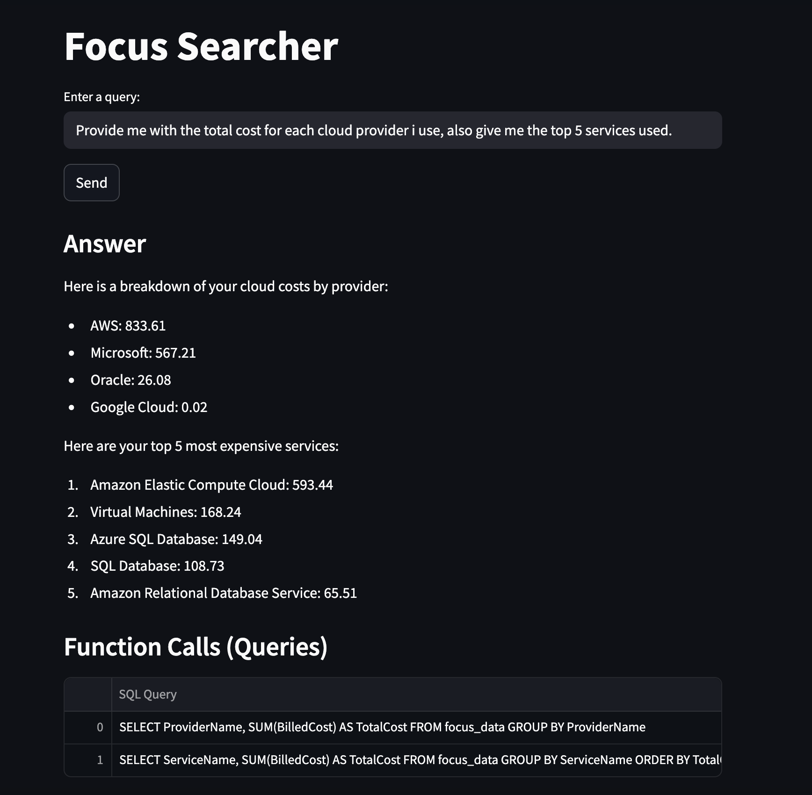
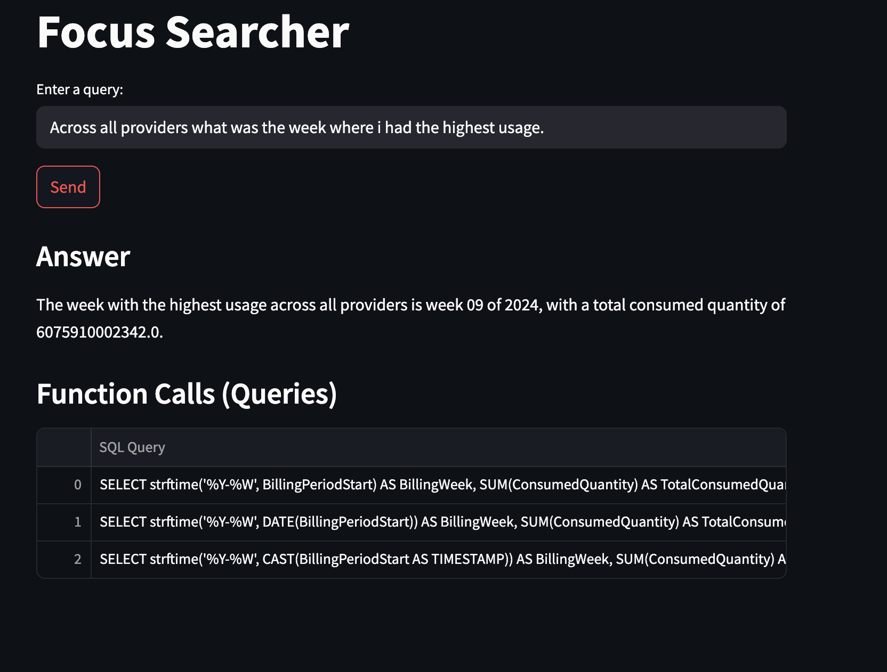

# Focus


## Components 

## Services

### 1. `uvicorn_app`
A FastAPI backend running under Uvicorn.

- **Build Context**: `.`
- **Port**: `8000`
- **Environment Variables**:
   - `HOST`: Listening address (default `0.0.0.0`)
   - `PORT`: Listening port (default `8000`)
   - `GOOGLE_API_KEY`: API key for Google services (set accordingly)
   - `MODEL_ID`: ID of the model to use (default `gemini-2.0-flash`)

### 2. `streamlit_app`
A Streamlit frontend application.

- **Build Context**: `.`
- **Port**: `8501`
- **Environment Variables**:
   - `UVICORN_APP_URL`: URL of the backend service (`http://uvicorn_app:8000`)
- **Command**:
   - `poetry run streamlit run streamlit_app.py`

## Usage

### Prerequisites
- Docker
- Docker Compose

### Running the Application

```bash
docker-compose up --build
```

This will expose the streamlit app 

http://localhost:8501/

### Sample usage






